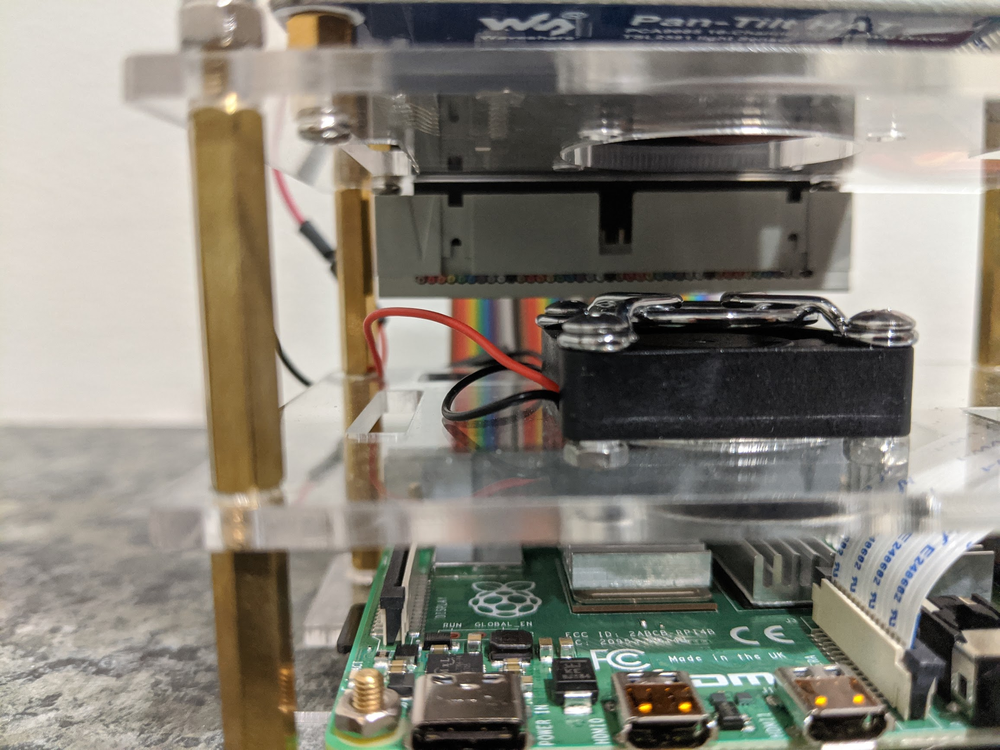
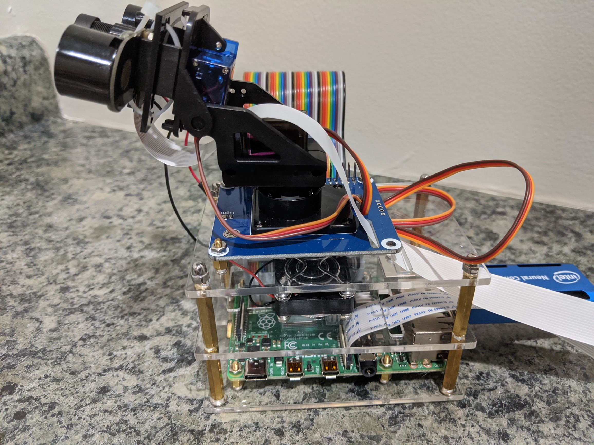
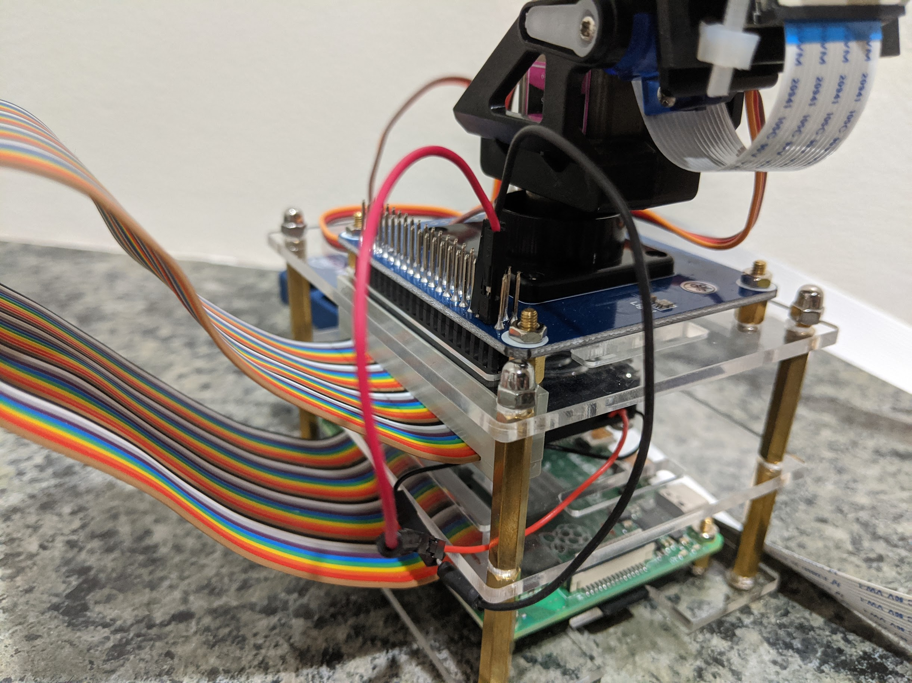

# Assembly

Assembly of the device can be achieved based on user preference. For this install, two sections of the iUniker Raspberry Pi Cluster Case are used to house the Raspberry Pi and Pan/Tilt hat. The Raspberry Pi is installed normally in the lower section of the case, but the fan is installed on the top (outside). It is recommended to install the heat sinks, connect and feed the Picam flex cable through the opening, and place the female end of the GPIO ribbon cable on the Raspberry Pi GPIO pins prior to connecting it to the center plastic enclosure piece. 

The most difficult part of assembly is attaching the pan/tilt hat to the uppermost section of the iUniker case. The top plastic enclosure piece (part that holds the pan/tilt hat) is the same piece that is used for the top of an iUniker enclosure (same as the middle piece). Once the pan/tilt hat is assembled (view instructions), place the hat on top of the iUniker and position it in such a way that you can mark the position of the 4 holes located in the corners of the pan/tilt hat PCB to the iUniker plastic. Once the holes are drilled, secure the pan/tilt hat to the plastic using the available hardware included with the iUniker kit. Notice in the image that I was only able to secure 3 out of the 4 holes to the plastic due to an opening in the iUniker plastic piece. Don't forget to attach the servo motor wiring to the bottom of the pan/tilt hat prior to securing it to the iUniker plastic. 

The last part of assembly includes attaching the fan to the 5v and ground GPIO pins, plugging in the Intel Movidius Compute Stick into one of the USB3.0 ports, connecting the micro-HDMI, keyboard, and mouse (if they are intended to be used), and attaching the male GPIO ribbon cable to pan/tilt hat. The positive (red) wire should connect to GPIO2 or GPIO4, and the ground (black) should connect to GPIO6. A GPIO pinout for the RPI4 can be found in the references section. 

