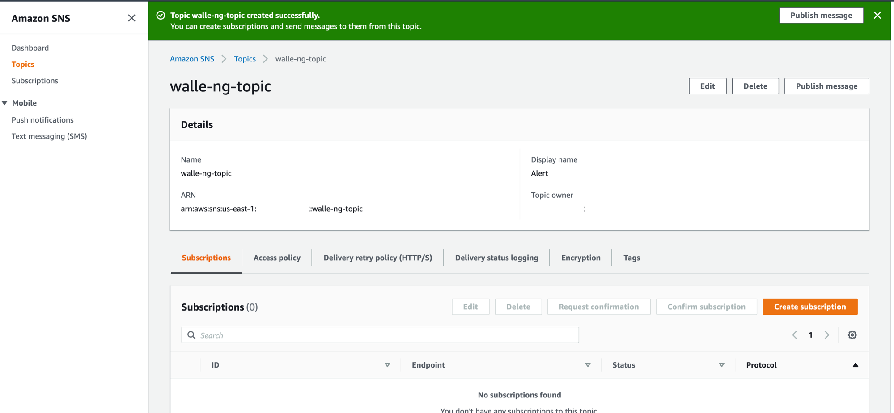
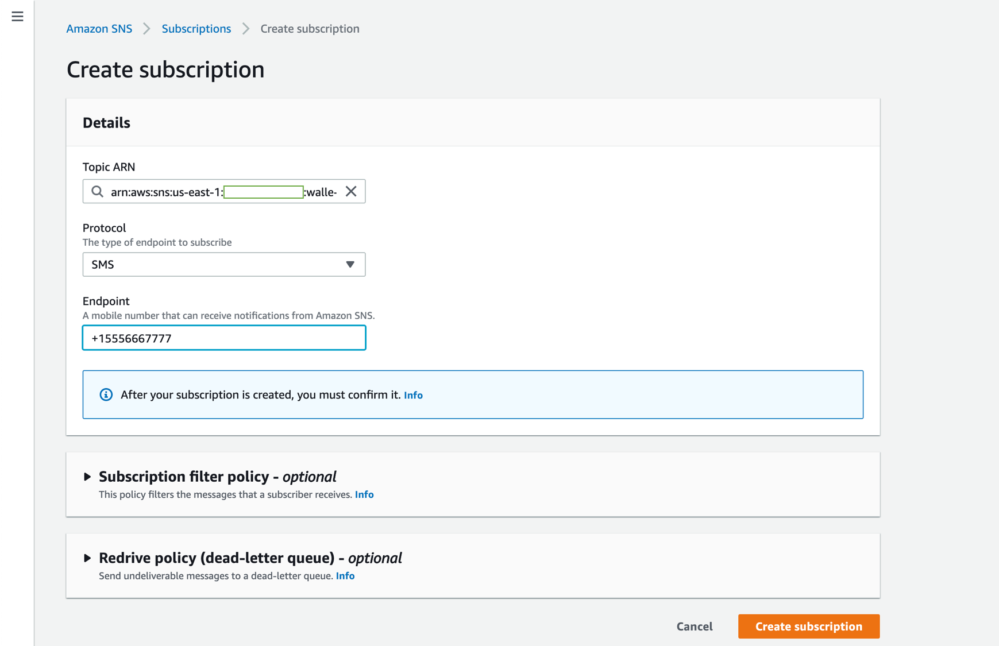
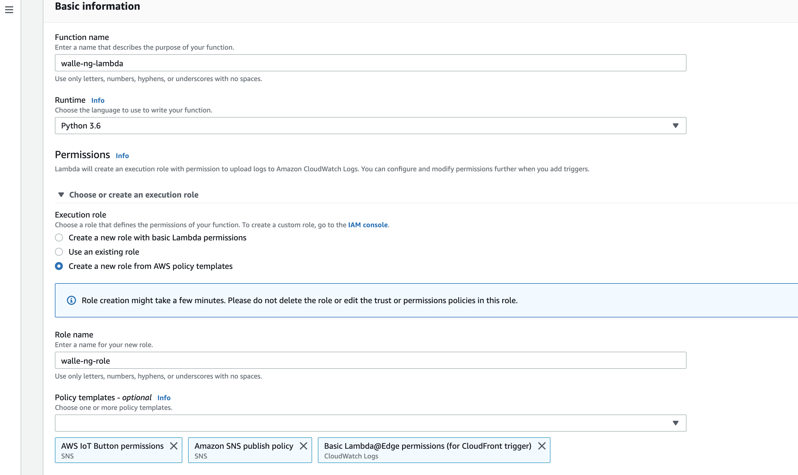
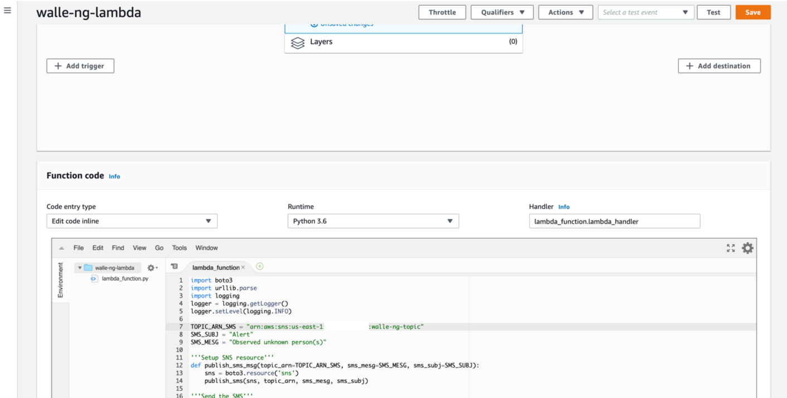
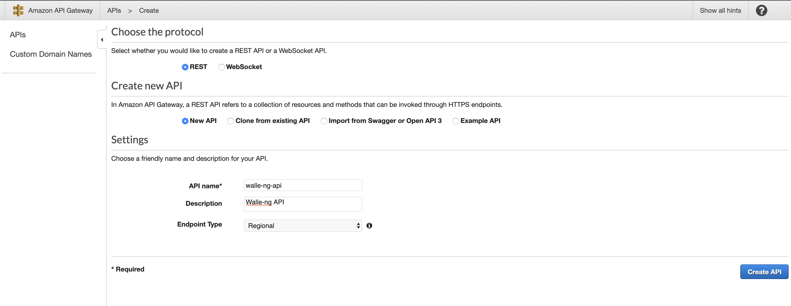
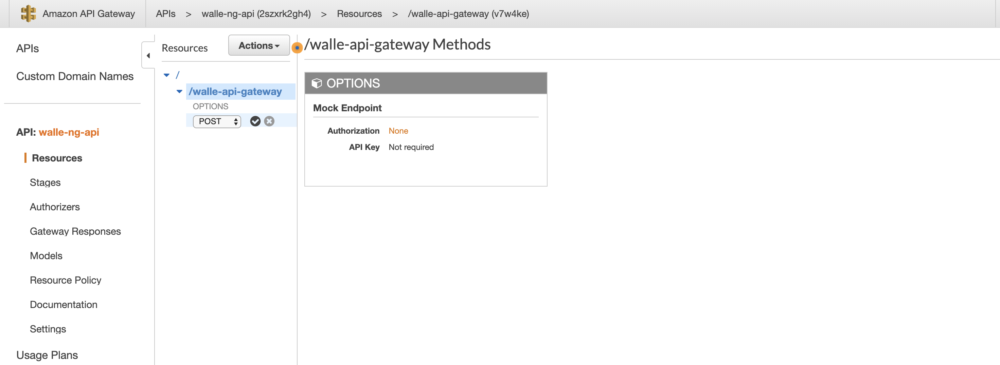
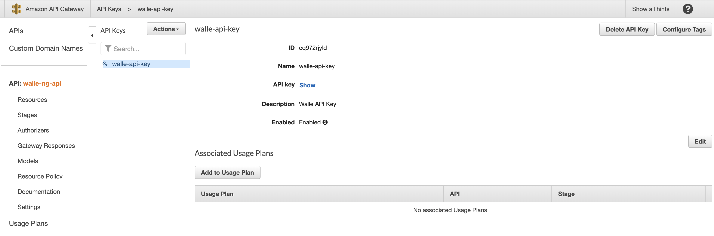
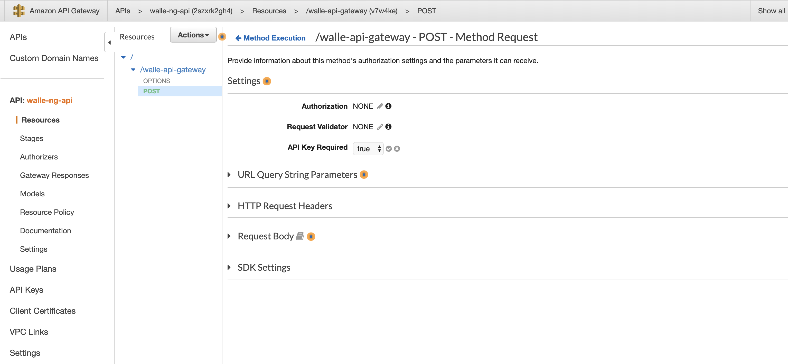

# Setting up Amazon Web Services

All the services used in this tutorial qualify for **[AWS Free Tier](https://aws.amazon.com/free/)** usage. If you do not have AWS console access, you will need to create an account on the **[AWS website](https://aws.amazon.com/console/)**. This section will provide details on setting up AWS SNS, API Gateway, and Lambda. 

## AWS Simple Notification Services (SNS)
SNS is a highly available, durable, secure, fully managed pub/sub messaging service that can be configured to send SMS or email messages to devices that subscribe to an SNS topic. For this project, one SNS topic will be created, and a mobile device will be configured as a subscriber to the topic. This is necessary to receive messages that are triggered from walle-ng events. In the AWS console, go to Simple Notification Services and perform the following actions:

Simple Notification Service (SNS) --> Topics --> Create topic

Set the following settings:
* Name: walle-sns-topic
* Display name: Alert
* Click --> Create topic

Once the topic is created, a view similar to the image below should be visible. Copy down the ARN associated with the walle-sns-topic. In this example, it is ```arn:aws:sns:us-east-1:846787677672:walle-ng-topic```.



Create a subscription to the topic:
* Click --> Create subscription
* Topic ARN: select the walle-sns-topic (if not already selected)
* Protocol: SMS (or email if you wish)
* Endpoint: +15556667777 (Enter phone number, or email if email was selected)
* Click --> Create subscription



SNS should be set up to send SMS messages to a mobile device. It is recommended to publish a test message to verify setup. In order to publish a test message, perform the following:

* In the sidebar, select Topics --> walle-ng-topic
* Click --> Publish message
* Subject: Test
* Message Body: Test Test
* Click --> Publish message

## AWS Lambda
AWS Lambda lets you run code without provisioning or managing servers. It is serverless, and will only run when a a POST request is made to API Gateway. Lambda will be responsible for parsing POST requests from walle-ng and publishing SNS messages. In AWS console, go to Lambda and perform the following actions:

Lambda --> Create Function --> Select "Author from scratch"

In the Basic information section, set the following:
* Function name: walle-ng-lambda
* Runtime      : Python3.6
* Role Name    : walle-ng-role
* Permissions  : Basic Lambda, Amazon SNS publish policy
* Click --> Create Function



Once the Lambda function is created, scroll down to the ```Function code``` section and copy/paste the code below into the ```lambda_function.py``` script. Under ```TOPIC_ARN_SMS```, change the value ```<sns_topic_arn>``` to the ARN you noted when you created the ```walle-ng-topic```. For this example, ```<sns_topic_arn>``` would be changed to ```arn:aws:sns:us-east-1:846787677672:walle-ng-topic```. 

When done, click --> Save. 

```python
import boto3
import urllib.parse
import logging
logger = logging.getLogger()
logger.setLevel(logging.INFO)

TOPIC_ARN_SMS = "<sns_topic_arn>"
SMS_SUBJ = "Alert"
SMS_MESG = "Observed unknown person(s)"

'''Setup SNS resource'''
def publish_sms_msg(topic_arn=TOPIC_ARN_SMS, sms_mesg=SMS_MESG, sms_subj=SMS_SUBJ):
    sns = boto3.resource('sns')
    publish_sms(sns, topic_arn, sms_mesg, sms_subj)

'''Send the SMS'''
def publish_sms(sns, topic_arn, sms_mesg, sms_subj):
    topic = sns.Topic(topic_arn)
    topic.publish(Message=sms_mesg, Subject=sms_subj)

'''Event handler'''
def lambda_handler(event, context):
    if event['httpMethod'] == 'POST':
        msg = event['body']
        msg = urllib.parse.parse_qs(msg)
        if msg['message']:
            alert = msg['message'][0]
            logger.info(alert)
            publish_sms_msg(sms_mesg=alert)
            return {
                'statusCode': 200,
                'headers': {
                    'Content-Type': 'application/json'
                },
                'body': 'OK'
            }
        else:
            return {
                'statusCode': 499,
                'headers': {
                    'Content-Type': 'application/json'
                },
                'body': 'Go Away!'
            }
    else:
        return {
            'statusCode': 499,
            'headers': {
                'Content-Type': 'application/json'
            },
            'body': 'Go Away!'
        }
```

The final output should look similar to the following:



In the next step, verify that the Lambda function is set up correctly by executing a test. Perform the following actions in the Lambda console:

* Click --> Test
* Check --> Create new Test
* Event name --> SMSTest
* Replace the JSON with the following and click --> create


```bash
{
    'httpMethod': 'POST',
    'body': 'message=Observed+test'
}
```

* Click --> Actions --> Publish new version
* Click --> Test

You should receive an SMS message to the phone number that was subscribed to the SNS topic. A successful message indicates that Lambda is configured properly to work with SNS. 

## AWS API Gateway
Amazon API Gateway is a fully managed service that makes it easy for developers to publish, maintain, monitor, secure, and operate custom APIs. API Gateway will be configured to accept POST requests containing messages from walle-ng. To add a layer of security to endpoint devices communicating with the API, an API key will be generated and walle-ng will be configured to use the API for each call. In AWS console, go to API Gateway and perform the following actions:

API Gateway --> Create API

Set the following:
* API name: walle-ng-api
* Description: Walle-ng API
* Click --> Create api



Select walle-ng-api --> Actions --> Create Resource

Set the following:
* Resource name: Walle API Gateway
* Resource path: walle-api-gateway
* Check --> Enable API Gateway CORS
* Click --> Create resource
* Click --> Actions --> Create method
* Select --> POST (when done, push the check mark button next to the drop down list)



In the POST setup window, set the following:
* Integration type: Lambda
* Check --> Use Lambda Proxy integration
* Lambda function: walle-ng-lambda
* Click --> Save
* Add Permission to Lambda Function click --> Ok

In the left sidebar, select API Keys
* Click --> API Keys --> Actions --> Create API Keys

Set the following:
* Name: walle-api-key
* Description: Walle API Key
* After the key is created, select the api key name --> Show (next to API Key). Write down the API key so it can be referenced in the future.



In the left sidebar, select APIs --> walle-ng-api

Set the following:
* Click --> POST --> Method Request
* Click --> API key required --> True --> Click the checkmark to save
* Click --> OPTIONS --> Method Request
* Click --> API key required --> True --> Click the checkmark to save
* Click --> Actions --> Enable CORS --> Enable CORS and replace existing CORS headers --> Yes, replace exsting values



Set the following values in Deploy API:
* Click --> Actions --> Deploy API
* Stage --> Stage
* Stage ame --> prod
* Click --> Deploy

Make note of the Invoke URL. This value will be used in the Walle client config. In this example, the Invoke URL is ```https://2szxrk2gh4.execute-api.us-east-1.amazonaws.com/prod```. In order to generate the URL that POST request will be sent to, add ```walle-ng-api``` to the end of the Invoke URL. The final URL for this example would be ```https://2szxrk2gh4.execute-api.us-east-1.amazonaws.com/prod/walle-ng-api```.

Before continuing to the Raspberry Pi installation section, make sure the URL above and the API area available in a notepad. During the walle-ng install, a script will ask for these values to make setup easier. 