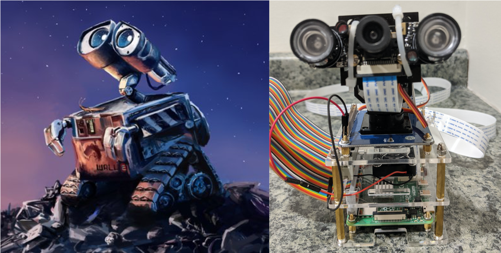

# Face Tracking, Recognition, and Notification using a Raspberry Pi 4B, Intel Movidius Neural Compute Stick, and Amazon Web Services

## Project Description
This project is focused on edge computing using a Raspberry Pi, Intel Movidius Compute Stick, and a Pi-cam to detect, track, and identify faces from a video stream in real-time. The application continuously monitors and adjusts the vertical and horizontal position of two servos based on the location of faces in a frame. If a face is detected, then the activity is logged and a notification SMS will be sent to the administrator using Amazon Web Services (AWS) API Gateway, Lambda, and Simple Notification Services (SNS). This project expands on the **[face recognition demo](https://github.com/opencv/open_model_zoo/tree/master/demos/python_demos/face_recognition_demo)** found in the OpenCV open model zoo. 

