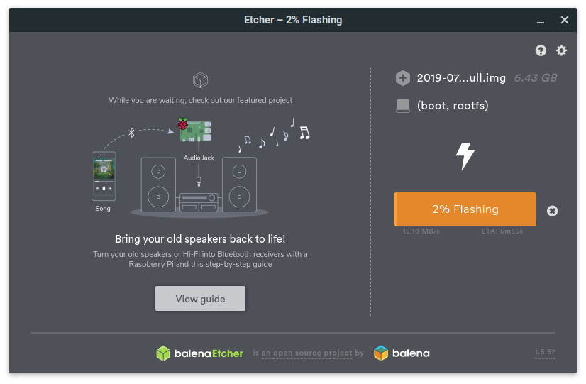
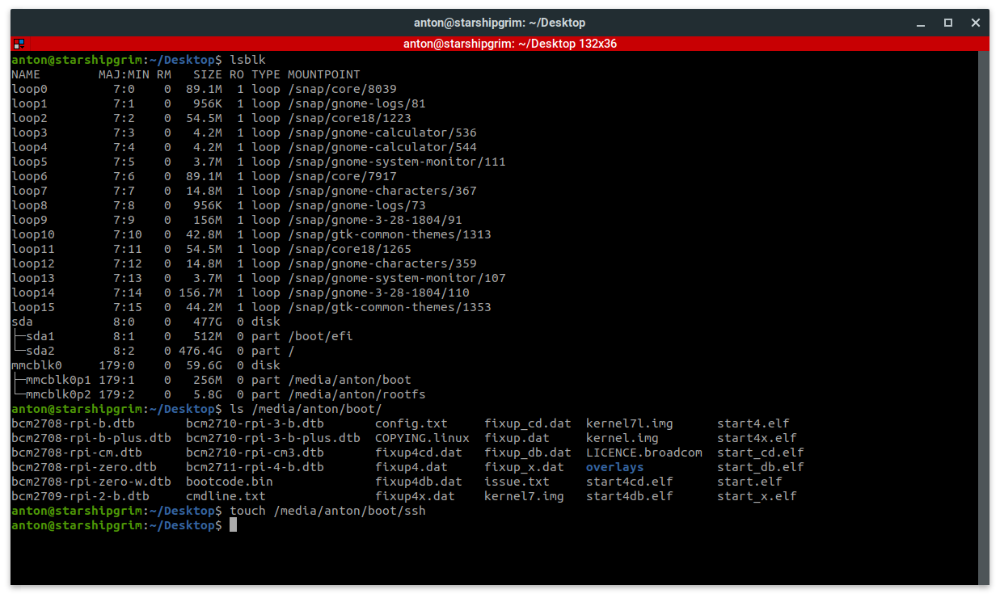
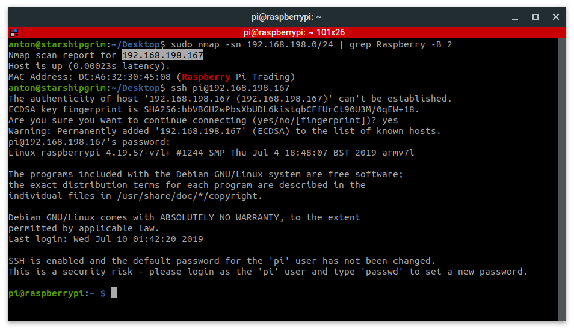

# Raspberry Pi Installation

At this point, the goal is to successfully flash the Raspbian OS to a micro SD card, enable SSH, and expand the filesystem. Once the system is running, project dependencies and tools will be installed to get a working "Walle" device. 

Begin by **[downloading Raspbian Desktop](https://www.raspberrypi.org/downloads/raspbian/)** to your computer. Create a bootable USB drive using **[Unetbootin](https://unetbootin.github.io/)**, **[BalenaEtcher](https://www.balena.io/etcher/)**, or **[Rufus](https://rufus.ie/)** and your micro SD card. For help on this subject, refer to the references section at the bottom of this tutorial. Some flash boot

```bash
# Alternative download with bash
wget https://downloads.raspberrypi.org/raspbian/images/raspbian-2019-09-30/2019-09-26-raspbian-buster.zip
shasum -a 256 2019-09-26-raspbian-buster.zip
unzip 2019-09-26-raspbian-buster.zip
```

Example using Balena Etcher to flash Raspbian OS to a micro SD card:



Next, re-insert the micro SD card into the computer and add a empty file named 'ssh' onto the boot partition. In Linux, issue ```lsblk``` to show the available drives and mount points. Issue ```touch /media/anton/boot/ssh``` to create the empty file. Note: This path will be different so it must be modified to reflect the path of the mounted micro SD card on your host machine. Once the file is created, unmount the bootable drive and insert the micro SD card into the Raspberry Pi. Note: If you plan on using a keyboard, mouse, and external monitor, you can skip this step and enable SSH when you login to the Raspberry Pi.

```bash
# Show partitions (after inserting the micro SD card)
lsblk

# View files in the boot partition
ls -la /media/anton/boot

# Create an empty ssh file in the boot partition and verify
touch /media/anton/boot/ssh
ls -la /media/anton/boot
```



Apply power and SSH or login to the the Raspberry Pi. If you need a quick way to find the IP address of your Raspberry Pi on your local LAN, use Nmap to locate it. The default password for new images is ```raspberry```.

```bash
# Locate Pi on the network
sudo nmap -sn 192.168.198.0/24 | grep Raspberry -B 2

# SSH to Pi using the password raspberry
ssh pi@192.168.198.167
```

Example of how to use nmap and SSH to the Raspberry Pi:



After SSHing, or gaining a shell via desktop GUI, use the ```sudo raspi-config``` command to expand the file system, enable the camera, and enable I2C. The specific settings that should be set are:

* Change User Password --> Set a new Pi password when prompted
* Network Options --> N2 Wi-fi --> Set your SSID and Password
* Localisation Options --> Change Locale --> Select 'en_US.UTF-8 UTF-8'
* Localisation Options --> Change Timezone --> America --> New York
* Interfacing Options --> P1 Camera --> Enable
* Interfacing Options --> P4 SPI --> Enable
* Interfacing Options --> P5 I2C --> Enable
* Advanced Options --> A1 Expand Filesystem
* Finish --> Reboot now --> Yes

Once complete, re-login or SSH to the Pi. 